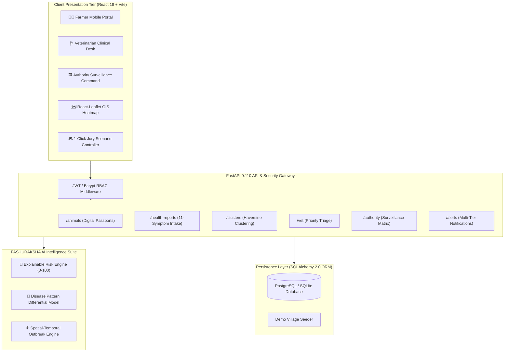

# PASHURAKSHA AI (पशुरक्षा AI) 🐄🩺
### Livestock Health Intelligence & Outbreak Early-Warning Platform

[](https://sih.gov.in/)
[](https://sih.gov.in/)
[](https://sih.gov.in/)
[](https://sih.gov.in/)
[](https://fastapi.tiangolo.com/)
[](https://react.dev/)
[](https://www.sqlalchemy.org/)

---

## 📌 1. Project Overview & SIH 2026 Problem Statement

- **Project Name**: PASHURAKSHA AI
- **PS ID**: `SIH26128` (Problem Statement #128)
- **Theme**: Agriculture, FoodTech & Rural Development
- **Problem Statement**: *Efficient systems for early detection, prevention and management of livestock diseases and animal health issues.*

### 🌟 The Core Innovation
Rural livestock mortality in India is primarily driven by delayed reporting and lack of spatial outbreak detection. **PASHURAKSHA AI** connects **Farmers**, **Veterinarians**, and **Public Health Authorities** in a closed-loop intelligence ecosystem:

$$\text{Farmer Symptoms Intake} \longrightarrow \text{Explainable AI Risk (0--100)} \longrightarrow \text{Haversine Spatial Clustering} \longrightarrow \text{GIS Heatmap} \longrightarrow \text{Vet Triage \& Authority Early Warning}$$

---

## 🏛️ 2. System Architecture



---

## 👥 3. Three Core Stakeholder Portals

### 🧑‍🌾 Role 1: Farmer Mobile Portal
- **Digital Livestock Passports**: Ear-tag generation, species picker (Cow, Buffalo, Goat, Sheep, Poultry), breed taxonomy, age, weight, lactation volume.
- **11-Symptom Intake Checklist**: 1-tap toggles for Fever, Cough, Nasal Discharge, Reduced Appetite, Diarrhea, Lethargy, Sudden Milk Drop, Dyspnea, Salivation, Lesions, and Swelling.
- **Instant AI Risk Feedback**: Immediate 0–100 risk score, transparent factor attribution, and veterinary isolation guidance.
- **Immunization Schedule**: Vaccine tracker for FMD, HS, BQ, and Brucellosis.

### 🩺 Role 2: Veterinarian Clinical Desk
- **Priority Triage Queue**: Cases ranked automatically by AI risk score (Critical cases requiring immediate farm dispatch listed first).
- **Embedded Regional GIS Outbreak Map**: Spatial overview of nearby active disease hotspots.
- **Clinical Investigation Modal**: Record diagnostic notes, prescribe medication, enforce farm quarantine, and order confirmatory laboratory diagnostic test referrals.

### 🏛️ Role 3: Authority Disease Surveillance Command
- **District Epidemiological KPIs**: Real-time monitored livestock, active health reports, active spatial clusters, hotspot villages, and district vaccination coverage %.
- **Full-Width Interactive GIS Heatmap**: OpenStreetMap canvas with pulsing markers and containment buffer zones.
- **Village Risk Stratification Matrix**:
  - `Rampur` ➔ **CRITICAL HOTSPOT** (84/100 risk index)
  - `Kalyanpura` ➔ **WATCHLIST** (42/100 risk index)
  - `Sanganer Outskirts` ➔ **NORMAL** (18/100 risk index)
  - `Amer North` ➔ **NORMAL** (8/100 risk index)
- **1-Click Rapid Outbreak Detection**: On-demand execution of spatial-temporal Haversine clustering with automated alert broadcast.

---

## 🔑 4. Demo Credentials & 1-Click Evaluation Scenarios

### Demo Accounts for Hackathon Jury Evaluation:

| Stakeholder Role | Email | Password | Dedicated Route |
| :--- | :--- | :--- | :--- |
| **🧑‍🌾 Farmer** | `farmer.ramesh@pashuraksha.ai` | `password123` | `/farmer/dashboard` |
| **🩺 Veterinarian** | `dr.sharma@pashuraksha.ai` | `password123` | `/vet/dashboard` |
| **🏛️ Authority** | `officer.verma@pashuraksha.ai` | `password123` | `/authority/dashboard` |

*(Note: You can also use the **1-Click Quick Launcher** on the landing page or login screen).*

### 🎮 Interactive 1-Click Jury Scenario Controller (Top Banner)
- 🟢 **Scenario A (Baseline Normal)**: Normal baseline health across monitored villages.
- 🔴 **Scenario B (Rampur Outbreak)**: Simulates a severe vesicular/BRD outbreak spike in Rampur, turns GIS heatmap critical red, and escalates cases to Veterinary Triage.
- 🟡 **Scenario C (Vet Ring Vaccination)**: Simulates veterinary deployment, orders confirmatory lab tests, and logs ring vaccination containment.

---

## 🚀 5. Quickstart Installation Guide

### Prerequisites
- Python 3.10+ (tested on Python 3.14)
- Node.js 18+ (tested on Node.js 20 LTS)
- Git

### 1. Clone Repository & Setup Virtual Environment
```bash
git clone https://github.com/your-org/pashuraksha-ai.git
cd "SIH demo"

# Setup Python Backend
cd backend
python -m venv .venv
# On Windows:
.\.venv\Scripts\activate
# On Linux/macOS:
# source .venv/bin/activate

pip install -r requirements.txt
cd ..
```

### 2. Setup Frontend Dependencies
```bash
cd frontend
npm install
cd ..
```

### 3. Launch Development Servers
```bash
# Terminal 1 — Start FastAPI Backend Server (Port 8000)
.\backend\.venv\Scripts\uvicorn.exe app.main:app --app-dir backend --host 127.0.0.1 --port 8000 --reload

# Terminal 2 — Start Vite Frontend Dev Server (Port 5173)
cd frontend
npm run dev -- --host 127.0.0.1 --port 5173
```

- **Frontend Application**: [http://127.0.0.1:5173](http://127.0.0.1:5173)
- **FastAPI Interactive Swagger Docs**: [http://127.0.0.1:8000/docs](http://127.0.0.1:8000/docs)

---

## 🧪 6. Automated Testing

Run the automated pytest test suite covering all 9 subsystems:
```bash
.\backend\.venv\Scripts\pytest.exe backend/tests/test_api.py -v
```

Output:
```
backend/tests/test_api.py::test_root_and_health_endpoints PASSED
backend/tests/test_api.py::test_authentication_and_jwt PASSED
backend/tests/test_api.py::test_animal_digital_passports_crud PASSED
backend/tests/test_api.py::test_ai_risk_engine_and_symptom_reporting PASSED
backend/tests/test_api.py::test_disease_pattern_model PASSED
backend/tests/test_api.py::test_spatial_clustering PASSED
backend/tests/test_api.py::test_alerts_pipeline PASSED
backend/tests/test_api.py::test_vet_clinical_triage PASSED
backend/tests/test_api.py::test_authority_surveillance_endpoints PASSED

======================= 9 passed in 3.65s =======================
```

---

## ⚖️ 7. Legal & Non-Diagnostic Medical Notice

> **Mandatory Non-Diagnostic Disclaimer**:
> *PASHURAKSHA AI provides AI-assisted health risk assessment, spatial cluster detection, and early-warning decision support. It does not replace professional veterinary diagnosis or treatment.*

---

## 🏆 Smart India Hackathon 2026 Deliverable
*Built with ❤️ for Indian Rural Livestock Health & Disease Prevention.*
