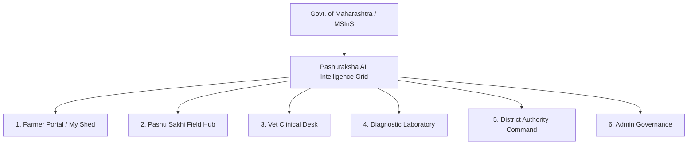

# PASHURAKSHA AI (पशुरक्षा AI) 🐄🩺
### Livestock Health Intelligence, Early-Warning & Epidemiological Response Platform

[](https://sih.gov.in/)
[](https://sih.gov.in/)
[-orange.svg)](https://msins.in/)
[](https://maharashtra.gov.in/)
[](https://fastapi.tiangolo.com/)
[](https://react.dev/)
[](https://vitejs.dev/)

---

## 📌 1. Project Overview & SIH 2026 Problem Statement

- **Project Name**: PASHURAKSHA AI (पशुरक्षा AI)
- **PS ID**: `SIH26128` (Problem Statement #128)
- **Target Department**: **Maharashtra State Innovation Society (MSInS)** under Department of Skills, Employment, Entrepreneurship & Innovation, and Department of Animal Husbandry, **Government of Maharashtra**.
- **Geography Focus**: Western Maharashtra Division (Pune, Nashik, Ahmednagar, Satara, Solapur, Kolhapur) with live epicenter in **Baramati Taluka (18.1515° N, 74.5772° E)**.
- **Problem Statement**: *Efficient systems for early detection, prevention and management of livestock diseases and animal health issues.*

---

## 🏛️ 2. The 6-Portal Ecosystem



### 1. 🐄 Farmer Portal (`/farmer/dashboard` & `/farmer/herd`)
- **Digital Ear-Tag Livestock Passports**: Animal profiles with QR/Tag numbers, species, age, lactation yields.
- **Batch Herd Management**: Filter livestock by species (Cattle, Buffalo, Goat, Sheep, Poultry), health status, and vaccination completeness.
- **Pashu-Drishti Vision AI (`/farmer/report`)**: Neural bounding box lesion scanner for oral blisters (FMD), LSD skin nodules, and hoof cleft erosions.
- **Marathi Voice-to-Symptom AI Reporter**: Audio symptom extraction in Marathi (`मराठी`) and English.

### 2. 🚶 Pashu Sakhi / Field Worker (`/field-worker/dashboard`)
- **Assigned Village Routes**: Baramati, Shirur, and Indapur farm visit queues.
- **On-Behalf Tele-Reporting**: 11-point symptom audits on behalf of non-smartphone farmers.
- **PWA Offline Storage Sync**: Auto-queues reports when rural connectivity drops.

### 3. 🩺 Veterinarian Clinical Desk (`/vet/dashboard`)
- **AI Triage Queue**: Ranked cases by multi-factor risk score (0–100) and mucosal synergy flags.
- **Clinical Lifecycle Timeline (`/vet/cases/:caseId`)**: Visual audit trail from first report to RT-PCR validation.
- **Official AI Prescription Generator**: Body weight-adjusted dosage engine (Meloxicam, Enrofloxacin, Flunixin) with mandatory milk/meat withdrawal warnings.

### 4. 🔬 Diagnostic Laboratory Portal (`/lab/dashboard`)
- **Sample Accessioning Queue**: Barcode samples with collection dates and species (Swabs, Blood, Milk).
- **Test Tracking**: RT-PCR, ELISA, Microscopic pathology runs.
- **1-Click Validation**: Positive validation auto-linked to state GIS disease clusters.

### 5. 🏛️ Public Health Authority Command (`/authority/dashboard` & `/authority/cold-chain`)
- **GIS Contagion Hotspot Radar**: Leaflet map centered on Pune/Baramati districts showing contagion radii (5km / 10km ring zones).
- **IoT Cold Chain Telematics**: Real-time 2°C–8°C temperature logging, vaccine vial monitor (VVM) stages, and stock requisition generator for IVBP, Pune.
- **Emergency Multilingual Broadcast Gateway**: Geofenced WhatsApp & SMS alerts to ~4,850 farmers.
- **Official State Epidemiological SITREP Briefing Generator**.

### 6. ⚙️ System Administration Console (`/admin/dashboard`)
- **5-Tier RBAC User Registry**: 27 pre-seeded Maharashtra users.
- **AI Risk Synergy Matrix Inspector**: Base symptom weights and synergy multipliers.
- **Village Weather Sensor Mesh**: Agro-climatic risk tracking.

---

## 🔑 3. 1-Click Login Personas (on `/login`)

| Role | Name | Organization / Village | Route |
| :--- | :--- | :--- | :--- |
| **🧑‍🌾 Farmer** | Ramesh Shinde | Baramati, Dist. Pune | `/farmer/dashboard` |
| **👩‍⚕️ Pashu Sakhi** | Sunita Patil | Shirur, Dist. Pune | `/field-worker/dashboard` |
| **🩺 Veterinarian** | Dr. Vivek Kulkarni | Baramati Veterinary Polyclinic | `/vet/dashboard` |
| **🔬 Lab Officer** | Dr. Neha Deshmukh | Regional Diagnostic Lab, Pune | `/lab/dashboard` |
| **🏛️ Health Authority** | Dr. Sanjay More | District Animal Husbandry Office | `/authority/dashboard` |
| **⚙️ State Admin** | MSInS Administrator | MSInS HQ, Mumbai | `/admin/dashboard` |

---

## 🚀 4. Quickstart Installation Guide

### Prerequisites
- Python 3.10+
- Node.js 18+

### 1. Setup Backend
```bash
cd backend
python -m venv .venv
# Windows:
.\.venv\Scripts\activate
# Linux/macOS:
# source .venv/bin/activate

pip install -r requirements.txt
python -m uvicorn app.main:app --host 0.0.0.0 --port 8000 --reload
```

### 2. Setup Frontend
```bash
cd frontend
npm install
npm run dev
```

- **Frontend App**: [http://localhost:5173](http://localhost:5173)
- **SIH Jury Presentation**: [http://localhost:5173/presentation](http://localhost:5173/presentation)
- **FastAPI OpenAPI Swagger**: [http://localhost:8000/docs](http://localhost:8000/docs)

---

## ⚖️ 5. Legal & Non-Diagnostic Notice

> **Mandatory Non-Diagnostic Disclaimer**:
> *PASHURAKSHA AI provides AI-assisted health risk assessment, computer-vision decision support, and epidemiological early-warning surveillance. It does not replace professional veterinary diagnosis or treatment.*

---

## 🏆 Smart India Hackathon 2026 Deliverable
*Developed for the Department of Skills, Employment, Entrepreneurship and Innovation & Maharashtra State Innovation Society (MSInS), Government of Maharashtra.*
