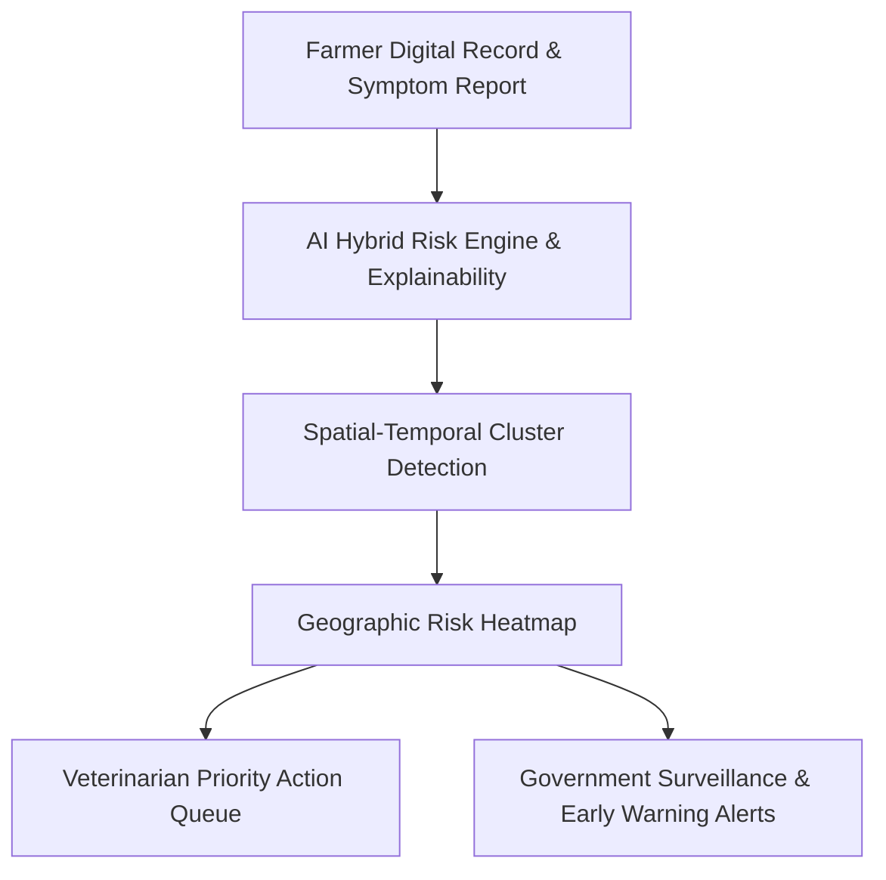

# PASHURAKSHA AI 🐾
### Livestock Health Intelligence & Outbreak Early-Warning Platform

**Smart India Hackathon 2026**  
- **Problem Statement ID**: SIH26128  
- **Theme**: Agriculture, FoodTech & Rural Development  
- **Category**: Software  

---

## 📌 Problem Overview
Livestock diseases can spread rapidly across rural clusters before farmers, field veterinarians, and government authorities recognize the emergent pattern. **PASHURAKSHA AI** is an AI-assisted decision-support and surveillance system designed for early detection, prevention, and proactive containment of animal health issues.

> [!NOTE]
> **Core Non-Diagnostic Principle**: PASHURAKSHA AI provides AI-assisted health risk assessment and early-warning decision support. It does not replace professional veterinary diagnosis or treatment.

---

## 🏛️ Core Architecture: 3-Tier Intelligence Flow



1. **Farmer Tier (Mobile-First)**: Digital livestock profiling, vaccination tracking, lightweight symptom reporting, and local risk alerts.
2. **Veterinarian Tier (Clinical Support)**: High-priority case triage, symptom analysis, explainable risk factors, and investigation workflow.
3. **Authority Tier (Public Health)**: District/village surveillance, outbreak hotspot heatmaps, vaccination coverage tracking, and proactive alert dissemination.

---

## 🛠️ Technology Stack

- **Frontend**: React 18, Vite, Tailwind CSS, Lucide Icons, Recharts, React Leaflet
- **Backend**: Python 3, FastAPI, Pydantic, SQLAlchemy, Uvicorn, JWT Auth
- **Database**: PostgreSQL (Supabase / Local)
- **AI/ML Engine**: Scikit-Learn, NumPy, Pandas (Explainable rule/hybrid risk engine & spatial clustering)

---

## 📂 Project Structure

```
PASHURAKSHA-AI/
├── frontend/             # React + Vite + Tailwind UI
├── backend/              # FastAPI REST API & AI Engine
│   └── app/
│       ├── ai/           # Risk Scoring & Spatial Clustering
│       ├── models/       # Database Models
│       ├── routes/       # API Endpoints
│       ├── schemas/      # Pydantic Schemas
│       └── services/     # Business Logic
├── data/                 # Sample & Synthetic Datasets
├── ml/                   # Model Training & Experiments
└── docs/                 # Architecture, API & Database Specs
```

---

## 🚀 Quickstart Guide (Phase 1)

### 1. Prerequisites
- Python 3.10+
- Node.js 18+ (LTS) & npm
- Git

### 2. Backend Setup
```bash
# Navigate to backend directory
cd backend

# Create & activate Python virtual environment
py -3 -m venv .venv
# On Windows PowerShell:
.venv\Scripts\Activate.ps1

# Install dependencies
pip install -r requirements.txt

# Start FastAPI server
uvicorn app.main:app --reload --port 8000
```
API Documentation available at: `http://127.0.0.1:8000/docs`

### 3. Frontend Setup
```bash
# Navigate to frontend directory
cd frontend

# Install packages
npm install

# Start Vite development server
npm run dev
```
Client Application available at: `http://localhost:5173`

---

## 🗺️ Development Roadmap
- [x] **Phase 1**: Environment & Project Foundation (FastAPI + Vite Scaffolding)
- [ ] **Phase 2**: Frontend Foundation & Layouts
- [ ] **Phase 3**: Backend Architecture & Services
- [ ] **Phase 4**: PostgreSQL Database Integration
- [ ] **Phase 5**: JWT Role-Based Authentication
- [ ] **Phase 6**: Farmer Mobile Dashboard
- [ ] **Phase 7**: Animal Digital Records
- [ ] **Phase 8**: Symptom Reporting Workflow
- [ ] **Phase 9**: AI Explainable Risk Engine
- [ ] **Phase 10**: Disease Assessment Module
- [ ] **Phase 11**: Community Outbreak Cluster Detection
- [ ] **Phase 12**: Interactive Geographic Heatmap
- [ ] **Phase 13**: Veterinarian Clinical Dashboard
- [ ] **Phase 14**: Government Authority Surveillance Portal
- [ ] **Phase 15**: Multi-Tier Alert Engine
